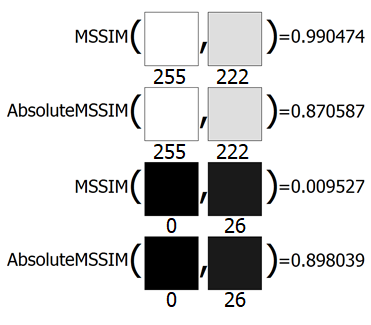

# Absolute-SSIM

SSIM or Structural Similarity is not a metric or distance function, different pixel value is weighted differently and sometimes can lead to undesired results. Two high values are easier to score high similarity even though the difference between the two is clearly visible and when comparing two low values the score is low similarity even when the two images look almost the same. This measurement bias is caused by some components in the SSIM.

Absolute SSIM is just another variance of SSIM by replacing the luminance and contrast component of the original SSIM with relative difference relation. 

# Documentation

Download link: http://arqiipubl.com/ojs/index.php/AMS_Journal/article/download/328/130.

# APA (7th Edition) Citation

Jaafar, M., Nawawi, S., & Abdul Rahim, R. (2022). Improving Measurement Bias of SSIM using Absolute Difference Equation. Arqiipubl.com. Retrieved from http://arqiipubl.com/ojs/index.php/AMS_Journal/article/download/328/130.
